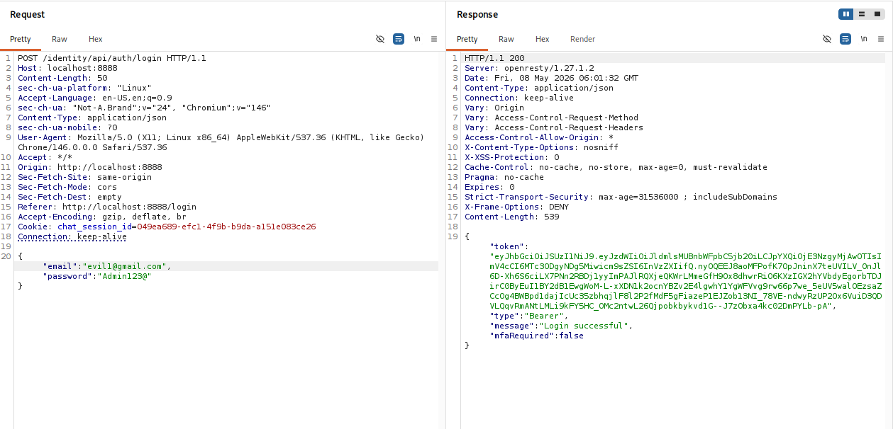
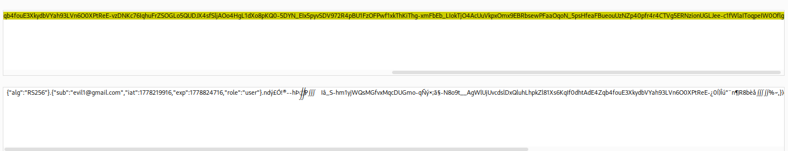
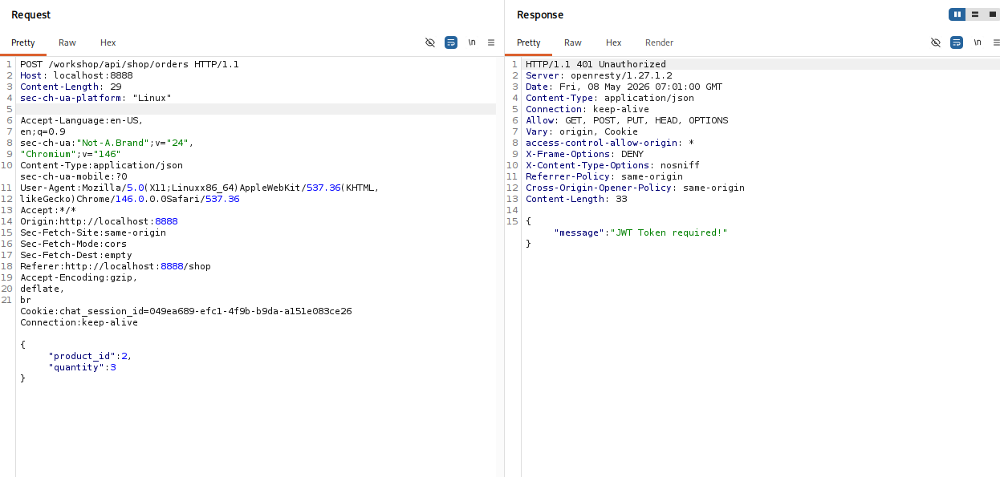
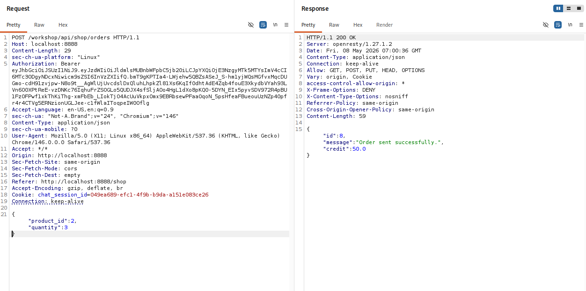
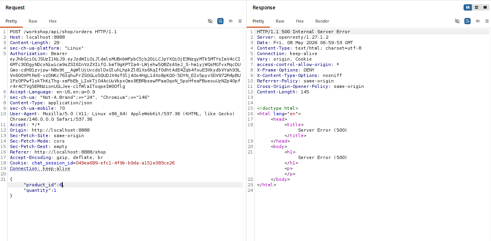
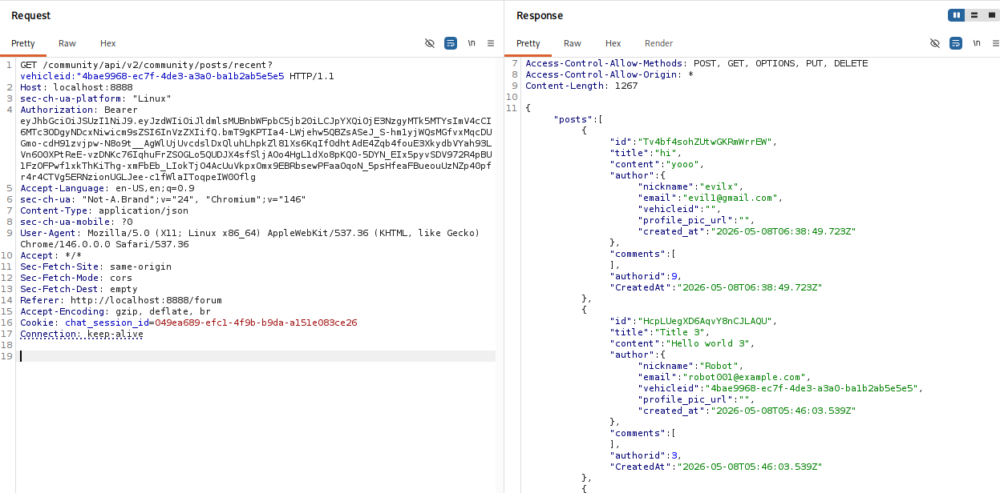

# 🔐 crAPI API Security Testing Lab

## Project Overview

This lab demonstrates API security testing against OWASP crAPI using Burp Suite to identify authentication, authorization, business logic, and input validation weaknesses.

---

## 🛠 Tools Used

- Burp Suite Community Edition
- Kali Linux
- Firefox Browser
- crAPI Vulnerable API Application

---

## 🔍 Areas Tested

- JWT Authentication
- API Request Manipulation
- Business Logic Testing
- Parameter Tampering
- Input Validation Testing
- Error Handling Assessment

---

## 🚨 Key Findings

### 1. JWT Authentication Enforcement

Protected API endpoints correctly rejected requests without valid JWT tokens.

### 2. Business Logic Manipulation

Manipulated order quantity parameters through Burp Suite Repeater to test business logic validation and credit handling behavior.

### 3. Weak Input Validation

Invalid product identifiers caused unhandled HTTP 500 responses, indicating insufficient server-side input validation and error handling.

### 4. API Workflow Analysis

Successfully analyzed:
- Login flow
- JWT token generation
- Order processing
- Community API responses

---

## Testing Workflow

1. Authenticated to the crAPI application using valid credentials
2. Intercepted API traffic using Burp Suite Proxy
3. Replayed and modified requests in Burp Repeater
4. Tested authentication and authorization enforcement
5. Performed parameter tampering and input validation testing
6. Analyzed API responses and application behavior

---

# Testing Evidence

## Login Request & JWT Token Response

---

## JWT Token Decoding

---

## JWT Authentication Enforcement

---

## Successful Order Request

---

## Quantity Manipulation Testing

---

## Invalid Product ID Triggering HTTP 500 Error

---

## Community API Response Analysis

---

## 📚 Skills Demonstrated

- API Security Testing
- Burp Suite Repeater
- JWT Analysis
- Business Logic Testing
- HTTP Request Manipulation
- Input Validation Testing
- Security Assessment Methodology

---

## ⚠ Disclaimer

This project was performed in a controlled lab environment using intentionally vulnerable applications for educational purposes only.

---

## Key Takeaways

- Improved understanding of JWT-based authentication workflows
- Practiced API request manipulation using Burp Suite
- Learned how business logic vulnerabilities impact application security
- Gained experience analyzing insecure API behaviors and error handling
